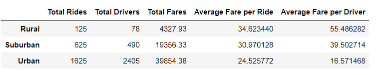
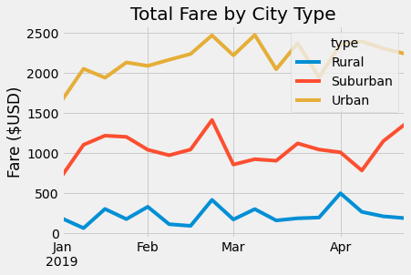

# PyBer_Analysis

## Overview
We undertake this data analysis project in order to determine what trends our data might show with regard to fares, rides, and drivers in cities of different types. Hopefully this analyis can help encourage business decisions which will drive growth for PyBer.
## Results
The basic table below shows that most money is made in Urban and Suburban cities. Additionally, the most expensive fare per ride occurs in Rural areas. The most extreme result is perhaps the fact that Average Fare per Driver is so much higher in Rural areas.

The line chart shows that in Q1 of 2019, the total fares collected was consistently highest in Urban areas. The relationship seems small, and certainly inconclusive from our sample, but there appears to be a slight upward trend in total fare collected as the year progresses into summer.

## Summary
Recommendations:
- Fares are high for riders in Rural areas. Use this as advertisement to increase the number of drivers in rural areas.
- Since fares are so high in Rural areas, we want to bring them down so that total ridership can increase. Find ways to reduce the cost to ride in small cities.
- Collect more data from more years on ridership throughout the year. It could be valueable to know relationships between season and ridership. We should do further analyis to provide more conclusive evidence.
